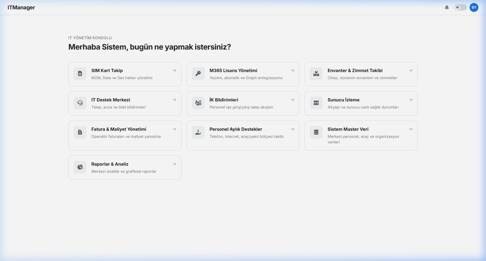
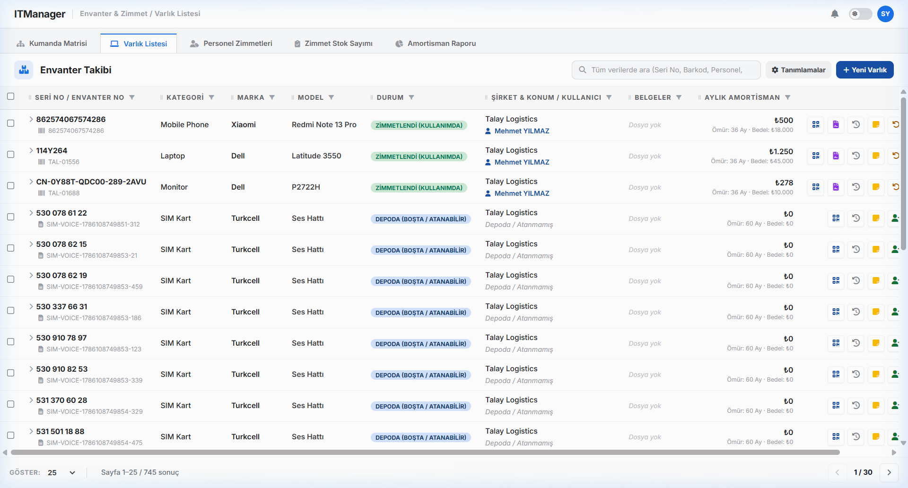
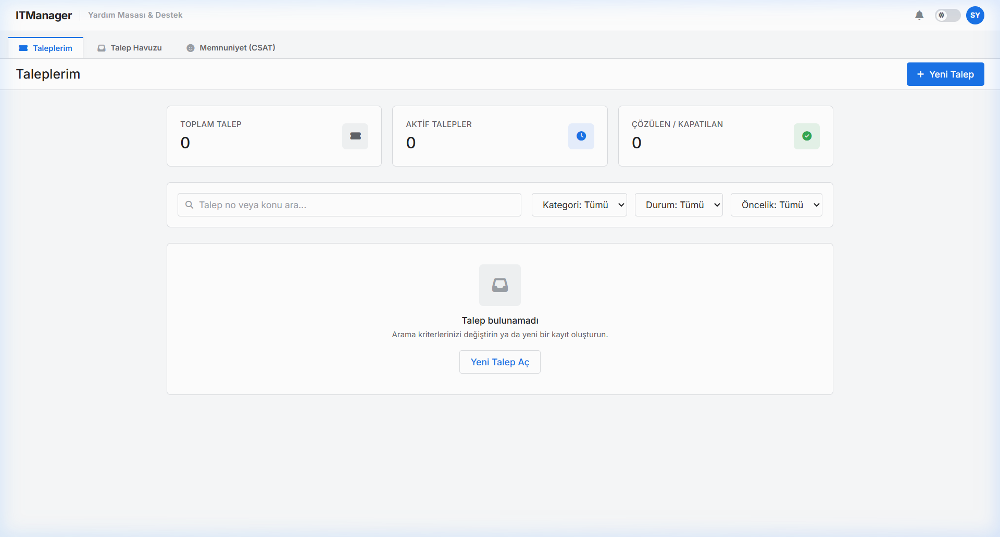
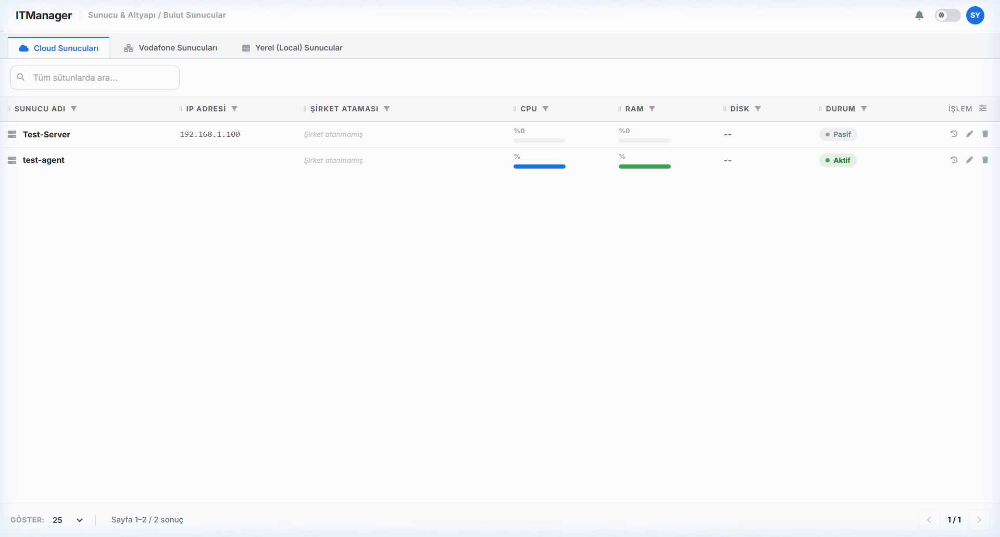
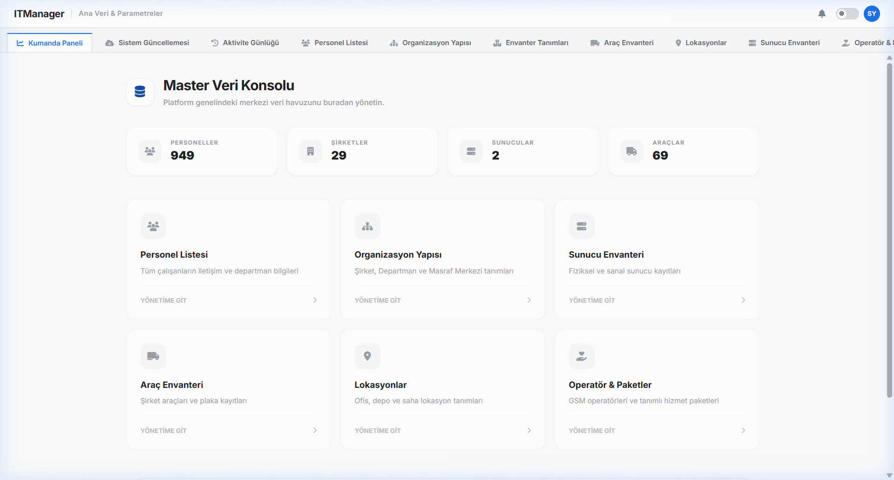
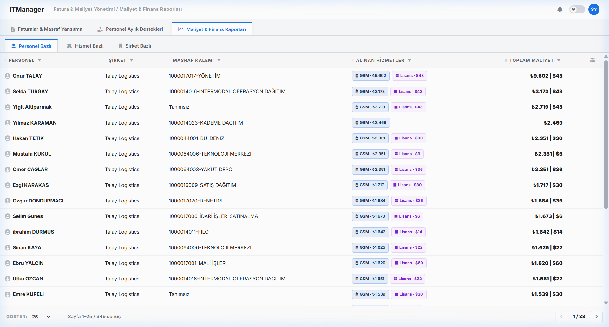
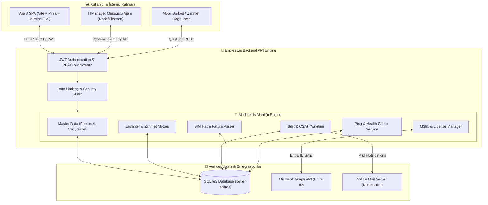

# 🖥️ ITManager — Kurumsal IT Yönetim Ekosistemi

> Kurumsal IT operasyonlarını, cihaz & zimmet takibini, teknik destek biletlerini, SIM hatlarını, M365 lisanslarını ve sunucu sağlık durumlarını tek bir merkezden yöneten modern, modüler ve tam kapsamlı **Full-Stack IT Yönetim Platformu**.

[](https://github.com/ufukkay/ITManager)
[](https://nodejs.org/)
[](https://vuejs.org/)
[](https://vitejs.dev/)
[](https://www.sqlite.org/)
[](https://learn.microsoft.com/en-us/graph/)
[](LICENSE)

---

## 📸 Ekran Görüntüleri & Görsel Önizlemeler

### 🏠 Ana Kumanda Paneli (Dashboard)


<details>
<summary>🔍 <b>Diğer Modül Ekran Görüntüleri için Tıklayın</b></summary>

<br>

#### 📦 Envanter & Zimmet Yönetimi


#### 🎫 IT Destek Merkezi (Helpdesk & Tickets)


#### 🖥️ Sunucu & Altyapı Canlı İzleme (Monitoring)


#### 🗄️ Master Veri Yönetimi (MDM)


#### 📊 Raporlama & Maliyet Analitiği


</details>

---

## 🏗️ Sistem Mimari Şeması



---

## 📋 İçindekiler

- [Öne Çıkan Modüller](#-öne-çıkan-modüller)
- [Teknoloji Yığını](#%EF%B8%8F-teknoloji-yığını)
- [Kurulum & Çalıştırma](#-kurulum--çalıştırma)
- [Proje Yapısı](#-proje-yapısı)
- [API Dokümantasyon Özet](#-api-dokümantasyon-özet)
- [Güvenlik ve Mimari](#-güvenlik-ve-mimari)
- [Lisans](#-lisans)

---

## 📦 Öne Çıkan Modüller

| Modül | Simgesi | Açıklama & Yetenekler |
|---|:---:|---|
| **Master Veri (MDM)** | 🗄️ | Şirket, Departman, Masraf Merkezi, Personel, Araç ve Sunucu master verilerinin merkezi yönetimi. Excel içe/dışa aktarım desteği. |
| **Varlık & Zimmet Takibi** | 💼 | Bilgisayar, monitör, telefon ve aksesuar zimmetleme, zimmet formu / etiketi üretici, amortisman hesaplama ve zimmet iade geçmişi. |
| **IT Destek (Helpdesk)** | 🎫 | Kullanıcı talep biletleri, öncelik sınıflandırması, teknisyen bilet havuzu atama, çözüm takibi ve otomatik CSAT anket bildirimleri. |
| **SIM Hat & Fatura Parser** | 📡 | M2M, Data ve Ses hatlarının operasyonel takibi. Operatör faturalarının (XML/Excel) otomatik çözümlenmesi ve masraf merkezlerine yansıtılması. |
| **M365 & Microsoft Graph** | 🔑 | Entra ID (Azure AD) ile canlı kullanıcı ve lisans senkronizasyonu. Atanmış / boştaki lisans maliyet analitiği. |
| **Sunucu İzleme** | 🖥️ | Cloud, Vodafone ve Yerel (Local) sunucuların ICMP Ping & TCP Port sağlık durumlarının canlı izlenmesi ve alarm paneli. |
| **İK Bildirimleri (HR)** | 📋 | Yeni işe başlayan veya ayrılan personeller için IT oryantasyon, donanım hazırlık ve hesap kapatma iş akışları. |
| **Masaüstü Ajan (Agent)** | 🤖 | İstemci cihazlara kurularak donanım/yazılım envanterini ve canlı durum bilgilerini merkeze bildiren arka plan servisi. |

---

## 🛠️ Teknoloji Yığını

### 🟢 Backend (API Server)
* **Runtime:** Node.js (v18+)
* **Framework:** Express.js (v4.18)
* **Veritabanı:** SQLite3 (`better-sqlite3` v9) — Yüksek performanslı senkron ilişkisel DB
* **Güvenlik:** JSON Web Token (JWT), `bcryptjs`, `rate-limiter-flexible`
* **Entegrasyonlar:** `@microsoft/microsoft-graph-client`, `nodemailer`, `exceljs`, `xml2js`

### 🔵 Frontend (UI Client)
* **Framework:** Vue.js 3 (Composition API `<script setup>`)
* **Build Tool:** Vite (v5)
* **State Management:** Pinia (v2)
* **Routing:** Vue Router (v4)
* **Styling:** Vanilla CSS, TailwindCSS (v3) & DaisyUI
* **Grafik & Analitik:** ApexCharts, Chart.js, XLSX Export Engine

---

## ⚡ Kurulum & Çalıştırma

### Ön Gereksinimler
- **Node.js**: v18.0.0 veya üzeri
- **npm**: v9.0.0 veya üzeri

### 1. Depoyu Klonlayın
```bash
git clone https://github.com/ufukkay/ITManager.git
cd ITManager
```

### 2. Backend Bağımlılıklarını Kurun & Yapılandırın
```bash
npm install
```

Kök dizinde `.env` dosyasını oluşturun:
```env
PORT=3001
JWT_SECRET=super-secret-key-change-in-production
RATE_LIMIT_MAX=100
SMTP_HOST=smtp.example.com
SMTP_PORT=587
SMTP_USER=your-email@domain.com
SMTP_PASS=your-password
MS_GRAPH_TENANT_ID=your-tenant-id
MS_GRAPH_CLIENT_ID=your-client-id
MS_GRAPH_CLIENT_SECRET=your-client-secret
```

### 3. Frontend Bağımlılıklarını Kurun
```bash
cd frontend
npm install
cd ..
```

### 4. Uygulamayı Başlatın

**Backend (Port 3001):**
```bash
npm run dev
```

**Frontend (Port 5173):**
```bash
cd frontend
npm run dev
```

Uygulamaya tarayıcınızdan `http://localhost:5173` adresinden erişebilirsiniz.

---

## 📁 Proje Yapısı

```
ITManager/
├── agent/                        # İstemci Masaüstü Ajanı (Node/Electron Telemetry)
├── docs/                         # Dokümantasyon ve Ekran Görüntüleri
│   └── screenshots/              # README UI Ekran Görselleri
├── frontend/                     # Vue 3 Frontend Uygulaması
│   ├── src/
│   │   ├── components/           # Reusable UI Bileşenleri (Table, Modal, Header)
│   │   ├── composables/          # Reusable Vue Logic
│   │   ├── layouts/              # Modül Yerleşim Şablonları
│   │   ├── router/               # Vue Router & Route Guards
│   │   ├── stores/               # Pinia State Stores
│   │   └── views/                # Modül Sayfa Görünümleri
├── scripts/                      # Veritabanı Migration & Test Scriptleri
├── src/                          # Backend Node.js API Kaynak Kodları
│   ├── app.js                    # Express Ana Sunucu Girişi
│   ├── database/                 # SQLite Şeması ve Veritabanı Bağlantısı
│   ├── middleware/               # Auth, Security & Rate Limiting
│   ├── services/                 # Mailer, MS Graph API vb. Servisler
│   └── modules/                  # Modüler API Mimarisi (Assets, Helpdesk, MDM vb.)
└── README.md
```

---

## 🔌 API Dokümantasyon Özet

| Modül | Metot | Endpoint | Açıklama |
|---|:---:|---|---|
| **Auth** | `POST` | `/api/auth/login` | Oturum açma & JWT alımı |
| **Master Data** | `GET / POST` | `/api/master-data/personnel` | Personel listeleme & yeni kayıt |
| **Assets** | `GET / POST` | `/api/assets` | Envanter kalemi ve zimmet işlemleri |
| **Helpdesk** | `GET / POST` | `/api/helpdesk/tickets` | Bilet takibi ve destek talepleri |
| **SIM Takip** | `POST` | `/api/sim/import/invoices` | Fatura XML/Excel yükleme ve eşleştirme |
| **M365** | `GET / POST` | `/api/m365/licenses` | M365 lisans ve Graph senkronizasyonu |
| **Monitoring** | `GET` | `/api/monitoring/status` | Canlı sunucu ping durumları |

---

## 🛡️ Güvenlik ve Mimari

* **JWT & RBAC Güvenliği:** Role-Based Access Control ile endpoint seviyesinde modüler erişim kısıtlaması.
* **Prepared Statements:** `better-sqlite3` ile tam SQL Injection koruması.
* **Rate Limiting & Brute Force Koruması:** `rate-limiter-flexible` middleware'i ile API katmanı koruması.
* **Audit Trail:** Tüm zimmet ve envanter değişikliklerinde tarihçe ve işlem yapan kullanıcı kaydı.

---

## 📄 Lisans

Bu proje **Özel / Kurumsal (Private)** lisans altındadır. İzinsiz kopyalanması, çoğaltılması veya ticari olarak dağıtılması yasaktır.

---

<p align="center">
  <strong>ITManager Ekosistemi</strong> · Geliştirici: <a href="https://github.com/ufukkay">ufukkay</a>
</p>
